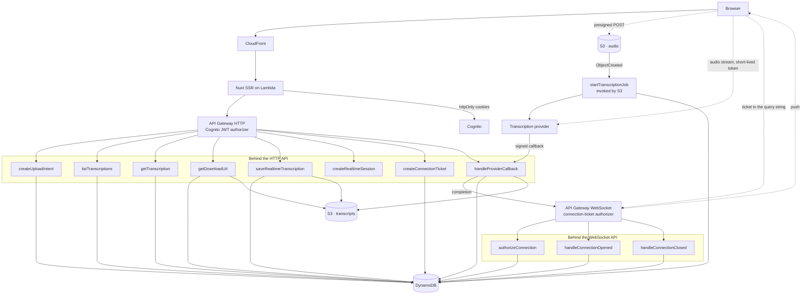

# Vocali Transcription Platform

A cloud service where a registered user transcribes audio, either by uploading a file or by speaking into a microphone, and can then browse and download the results.

Built on AWS Lambda, DynamoDB, S3 and Cognito, defined in Terraform, with a Nuxt front end.

## Status

All seven capabilities in the brief are implemented and tested, and the `prod` environment is applied to AWS.

```bash
pnpm install
pnpm typecheck
pnpm test
```

1,358 tests across the API, the front end and the shared contracts. None of them reach the network or an AWS account, so there is nothing to configure first.

What is missing is the public front door. AWS will not create a CloudFront distribution on an account it has not verified, and will not allow public access to a Lambda function URL on the same grounds, so the renderer has no address of its own. Everything behind it is deployed and answering. Running the front end locally against the deployed environment exercises the whole platform, from registration through an upload to a downloaded transcript.

Deploying found a defect no test could. The submission function could read the provider API key but not the webhook secret, so every upload stopped at `PENDING_UPLOAD` in silence. The suite doubles the secrets provider, so a read always succeeds there; only IAM disagreed.

## Contents

- [What it does](#what-it-does)
- [Architecture](#architecture)
- [Why the design looks like this](#why-the-design-looks-like-this)
- [Repository layout](#repository-layout)
- [Running it locally](#running-it-locally)
- [Testing](#testing)
- [Deployment](#deployment)
- [Decisions](#decisions)

## What it does

| Capability                          | Notes                                                       |
| ----------------------------------- | ----------------------------------------------------------- |
| Register and confirm an account     | Cognito user pool with mandatory email verification         |
| Sign in and out                     | Sign-out is invalidated at Cognito, not only in the browser |
| Transcribe an audio file            | Up to 20 MB, uploaded straight to S3                        |
| Transcribe live from the microphone | Partial results appear while you speak                      |
| Browse transcription history        | Ten per page, newest first, cursor paginated                |
| Download a transcription            | Short-lived signed URL, plain text or JSON                  |
| Read it light or dark               | Light, dark, or whatever the machine is set to              |
| Read it in Spanish or English       | Spanish by default; the choice changes no URL               |

The validation, state transitions, pagination and ownership rules behind each row are implemented and tested, and so are the screens in front of them.

The interface language is a separate setting from the language spoken in a recording. Someone can dictate in Catalan while reading the screen in English. They are separate types with separate storage, so neither can start driving the other by accident.

## Architecture

Twelve functions, all deployed. CloudFront is the one box below that is configured but not created, for the account reason given above.



**Uploading a file.** The browser asks for an upload intent, receives a presigned POST, and sends the file straight to S3. An `ObjectCreated` event starts a transcription job, passing the provider a short-lived signed URL to fetch the audio itself. When the job finishes the provider calls back, the transcript is written to S3, and the record is marked complete.

**Live transcription.** A Lambda mints a token valid for sixty seconds and the browser opens a WebSocket directly to the provider. When the user stops, the final text is posted back and stored like any other transcription.

## Why the design looks like this

Three constraints shaped most of the rest.

**A 20 MB file cannot travel through the API.** API Gateway caps a request at 10 MB and Lambda at 6 MB, and base64 encoding inflates a payload by a third. So the upload goes directly from the browser to S3 through a presigned POST whose policy carries a `content-length-range` condition. S3 enforces the size limit itself, before any of our code runs, which a client cannot talk its way past.

**Lambda cannot hold a duplex WebSocket.** Live transcription needs a persistent connection to the provider, and a function that lives for the length of one request cannot keep one. So the backend mints a short-lived credential and the browser connects directly. The long-lived API key never leaves the server, the audio never touches our infrastructure, and each session expires on its own.

That constraint is about a function holding a socket, which is a different thing from how a completion reaches the browser. There, API Gateway holds the connection: one function is invoked on connect, another on disconnect, and sending is an ordinary HTTPS request naming a connection the sender has never seen. A completion is one message in one direction, so it can work that way. A live dictation is a continuous two-way audio stream, so it cannot.

Authenticating that connection took some care. A browser cannot set headers on a websocket, so the usual answer is an access token in the query string, and a query string reaches the access log. An authenticated endpoint mints a short-lived, single-use ticket instead, and the connect authorizer spends it with the same call that reads it, so two connections racing the same ticket cannot both win. Verified against the deployed environment: presenting one ticket twice connects once and is refused the second time.

**DynamoDB has no offset pagination.** History is a single `Query` on a partition key of `USER#<sub>` with a sort key of `TRANS#<ULID>`, read backwards with a limit of ten. The ULID makes chronological order free, the partition key makes cross-user isolation structural rather than a check someone can forget, and the client receives an opaque cursor. There is no `Scan` anywhere in the codebase.

## Repository layout

```
apps/api           Backend: domain, application, infrastructure, presentation
apps/web           Nuxt front end: components, pages, server routes
packages/contracts Zod schemas shared by both sides
infra              Terraform: bootstrap, modules, one directory per environment
docs/adr           Decision records
```

The backend is organised in layers. `domain` depends only on the shared contracts package, and only on its Zod-free constants entry point. `application` depends on `domain` and on port interfaces. `infrastructure` and `presentation` depend inwards and never the other way.

ESLint enforces that rule rather than a document describing it. Importing an AWS SDK from the domain layer fails `pnpm lint`, with a message naming the layer that was violated.

The front end follows Atomic Design, with one rule doing a similar job: atoms, molecules and organisms are plain Vue and may not reach a Nuxt runtime composable. That is what lets Jest mount them in milliseconds without booting Nuxt, and it is enforced the same way. Pages, layouts, middleware and server routes may use the runtime freely.

The practical benefit is that every use case is tested against in-memory doubles with no AWS, no network and no SDK mocks, so the business suite runs in about a second.

`packages/contracts` holds one Zod schema per endpoint, and both the server's validation and the client's types derive from it. A field cannot change on one side without breaking compilation on the other.

## Running it locally

Requires Node 24 and pnpm 10.

```bash
pnpm install
pnpm typecheck
pnpm test
pnpm test:coverage
```

No configuration is needed, because nothing in the suite reaches the network or an AWS account.

The end-to-end suite needs a built front end and a server to drive, and no configuration either, because every call it makes to `/api/**` is answered in the browser:

```bash
pnpm --filter @vocali/web build
pnpm --filter @vocali/web preview &
pnpm e2e
```

Running the front end against real infrastructure needs the values in `.env.example`. Secrets are read from AWS Parameter Store at runtime, so that file holds parameter paths and placeholders only.

## Testing

| Layer                | Tool                         | What it covers                                                     | State    |
| -------------------- | ---------------------------- | ------------------------------------------------------------------ | -------- |
| Domain and use cases | Jest                         | Entities, value objects, every use case, against in-memory doubles | Complete |
| Adapters             | Jest + `aws-sdk-client-mock` | DynamoDB, S3 and provider adapters, offline                        | Complete |
| Components           | Jest + Vue Test Utils        | Presentational components in isolation                             | Complete |
| End to end           | Cypress                      | Nine user journeys, in a browser against a built front end         | Complete |

The end-to-end suite answers every call to `/api/**` in the browser, and replaces the two capabilities that have no HTTP boundary: the microphone, through `getUserMedia`, and the provider's transcription stream, through the `WebSocket` constructor. So it proves what the browser does. It covers the guarded routes and where a redirect lands, the multipart body the browser assembles for the presigned upload, the cursor the history pages by, and the signed URL asked for at click time. It proves nothing about AWS, which takes no part in it.

Coverage thresholds are enforced by `pnpm test:coverage` and fail the build. They have never been lowered to make a build pass.

One standard is applied throughout: a test that still passes when the behaviour it targets is reverted is not testing anything. Several tests here were rewritten after being checked that way. Among them a null check that could not distinguish a correct record from an overwritten one, assertions that stayed green when the lifetime of a signed URL was cut from fifteen minutes to one second, and a cross-user isolation test whose assertion was true of both users' records.

## Deployment

Everything is defined in Terraform under `infra/`: the remote state bootstrap, the Cognito user pool, the DynamoDB table, both buckets with their CORS and lifecycle rules, the twelve functions with an execution role and a log group each, the HTTP API and its Cognito authorizer, the WebSocket API that carries completions to the browser, the CloudFront distribution in front of the renderer, four alarms, and a deployment role assumed through OIDC so no long-lived AWS credential exists anywhere.

The `prod` environment is applied. The public edge is not. A module variable publishes the renderer without a distribution while AWS has the account under verification, so the deviation lives in the repository rather than in somebody's console history, and clearing it restores the distribution, the IAM-signed origin and the bucket grant in one apply. `infra/README.md` covers how it is composed and what it decides.

Four constraints appeared only at apply, and none of them could have been found offline. A WebSocket stage refuses to exist until an account-wide CloudWatch role is set. A metric-math alarm takes ten elements, so one term per function put a ceiling on how many functions the platform could have. API Gateway rejects an authorizer cache lifetime on a WebSocket API outright. And a fresh account is capped at 512 MB per function.

CI runs formatting first, Prettier for the workspace and `terraform fmt` for the HCL, then linting, type checking, and the unit suites with their coverage thresholds. The Cypress journeys run as a separate job, because they need a built application, a running server and a browser, and a failure there should report on its own line. A dependency audit runs in a third job so that a new upstream advisory cannot mask a genuine test failure, and commit messages are linted on pull requests. There is no deploy job yet; the OIDC role is what one would assume when there is.

## Decisions

The decisions worth arguing about, with the alternative that was rejected. The ones recorded in full live in [`docs/adr/`](docs/adr).

- **Terraform rather than the Serverless Framework.** Most of this platform is not Lambda. Cognito, CloudFront, buckets, IAM and alarms are all easier to review as one dependency graph than as a serverless manifest with a large block of raw CloudFormation attached.
- **Tokens in `httpOnly` cookies, set by the Nuxt server.** The browser never holds a Cognito token in JavaScript-readable storage, which removes the usual reward for a cross-site scripting bug.
- **The provider callback carries the transcription identity.** The webhook resolves its record by primary key rather than by a secondary index. That removed an index, the eventual-consistency race the index introduced, and the retry logic that race would have required. It also lets a completed transcription be recovered even if the job id was never persisted.
- **Duplicate deliveries are acknowledged, not rejected.** S3 events and provider callbacks are both at-least-once. A redelivery returns success without changing anything, so the sender stops retrying instead of filling a dead-letter queue with events that were never problems.
