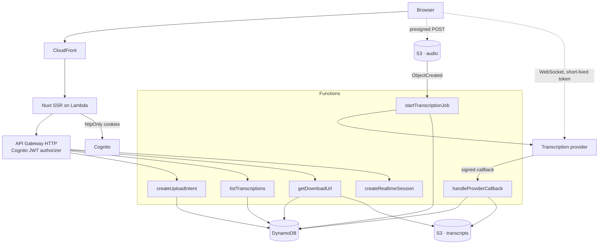

# Vocali Transcription Platform

A cloud service that lets registered users transcribe audio, either by uploading a file or by speaking into their microphone, and then browse and download their transcription history.

Built on AWS Lambda, DynamoDB, S3 and Cognito, defined end to end in Terraform, with a Nuxt front end.

## Contents

- [What it does](#what-it-does)
- [Architecture](#architecture)
- [Why the design looks like this](#why-the-design-looks-like-this)
- [Repository layout](#repository-layout)
- [Running it locally](#running-it-locally)
- [Testing](#testing)
- [Deployment](#deployment)
- [Decisions](#decisions)

## What it does

| Capability                          | Notes                                                       |
| ----------------------------------- | ----------------------------------------------------------- |
| Register and confirm an account     | Cognito user pool with mandatory email verification         |
| Sign in and out                     | Sign-out is invalidated at Cognito, not only in the browser |
| Transcribe an audio file            | Up to 20 MB, uploaded straight to S3                        |
| Transcribe live from the microphone | Partial results appear while you speak                      |
| Browse transcription history        | Ten per page, newest first, cursor paginated                |
| Download a transcription            | Short-lived signed URL, plain text or JSON                  |

## Architecture



**Uploading a file.** The browser asks for an upload intent, receives a presigned POST, and sends the file straight to S3. An `ObjectCreated` event starts a transcription job, passing the provider a short-lived signed URL to fetch the audio itself. When the job finishes the provider calls back, the transcript is written to S3 and the record is marked complete.

**Live transcription.** A Lambda mints a token valid for sixty seconds and the browser opens a WebSocket directly to the provider. When the user stops, the final text is posted back and stored like any other transcription.

## Why the design looks like this

Three constraints shaped almost everything else.

**A 20 MB file cannot travel through the API.** API Gateway caps a request at 10 MB and Lambda at 6 MB, and base64 encoding inflates a payload by a third. The upload therefore goes directly from the browser to S3 via a presigned POST whose policy carries a `content-length-range` condition. The size limit is enforced by S3 itself, before any code runs — not by a validation that a client could lie its way past.

**Lambda cannot hold a duplex WebSocket.** Live transcription needs a persistent connection to the provider, and a function that lives for the length of one request cannot keep one. So the backend mints a short-lived credential and the browser connects directly. The long-lived API key never leaves the server, the audio never touches our infrastructure, and each session expires on its own.

**DynamoDB has no offset pagination.** History is a single `Query` on a partition key of `USER#<sub>` with a sort key of `TRANS#<ULID>`, read backwards with a limit of ten. The ULID makes chronological order free, the partition key makes cross-user isolation structural rather than a check someone can forget, and the client receives an opaque cursor. There is no `Scan` anywhere in the codebase.

## Repository layout

```
apps/api           Backend: domain, application, infrastructure, presentation
apps/web           Nuxt front end
packages/contracts Zod schemas shared by both sides
infra              Terraform
docs/adr           Architecture decision records
```

The backend follows a hexagonal structure. `domain` imports nothing. `application` depends only on `domain` and on port interfaces. `infrastructure` and `presentation` depend inwards and never the other way.

That rule is not a convention in a document — it is enforced by ESLint and breaks the build. Importing an AWS SDK from the domain layer fails `pnpm lint`.

The practical benefit is that every use case is tested against in-memory doubles with no AWS, no network and no SDK mocks, so the whole business suite runs in about a second.

`packages/contracts` holds one Zod schema per endpoint, from which both the server's validation and the client's types are derived. A field cannot change on one side without breaking compilation on the other.

## Running it locally

Requires Node 24 and pnpm 10.

```bash
pnpm install
pnpm typecheck
pnpm test
```

Copy `.env.example` to `.env` and fill it in to run against real infrastructure. Secrets are read from AWS Parameter Store at runtime; nothing sensitive belongs in the repository or in a plaintext environment variable.

## Testing

| Layer                | Tool                         | What it covers                                                     |
| -------------------- | ---------------------------- | ------------------------------------------------------------------ |
| Domain and use cases | Jest                         | Entities, value objects, every use case, against in-memory doubles |
| Adapters             | Jest + `aws-sdk-client-mock` | DynamoDB, S3 and provider adapters, offline                        |
| Components           | Jest + Vue Test Utils        | Presentational components in isolation                             |
| End to end           | Cypress                      | The seven user journeys                                            |

Coverage thresholds are enforced by the test command and fail the build. They have never been lowered to make a build pass.

One standard is applied throughout: **a test that still passes when the behaviour it targets is reverted is not testing anything.** Several tests in this repository were rewritten after being checked that way — a null check that could not distinguish a correct record from an overwritten one, and assertions that stayed green when the lifetime of a signed URL was changed from fifteen minutes to one second.

## Deployment

Everything is defined in Terraform: the Cognito user pool, the DynamoDB table, both buckets with their CORS and lifecycle rules, the API and its authorizer, every function with its own least-privilege role, the CloudFront distribution, log retention and alarms.

```bash
cd infra/environments/prod
terraform init
terraform plan
terraform apply
```

CI runs linting, formatting, type checking, unit tests with coverage, Cypress, and static analysis of the Terraform. Deployment authenticates to AWS through OIDC, so no long-lived AWS credentials are stored anywhere.

## Decisions

`docs/adr/` records the decisions worth arguing about, each with the alternatives considered and the consequences accepted. The ones that shaped the most code:

- **Terraform rather than the Serverless Framework.** Most of this platform is not Lambda — Cognito, CloudFront, buckets, IAM, alarms — and one tool describing all of it in a single dependency graph is easier to review than a serverless manifest with a large block of raw CloudFormation attached.
- **Tokens in `httpOnly` cookies, set by the Nuxt server.** The browser never holds a Cognito token in JavaScript-readable storage, which removes the usual reward for a cross-site scripting bug.
- **The provider callback carries the transcription identity.** The webhook resolves its record by primary key rather than by a secondary index. This removed an index, the eventual-consistency race that index introduced, and the retry logic that race would have required — and it lets a completed transcription be recovered even if the job id was never persisted.
- **Duplicate deliveries are acknowledged, not rejected.** S3 events and provider callbacks are both at-least-once. A redelivery returns success without changing anything, so the sender stops retrying instead of filling a dead-letter queue with events that were never problems.
