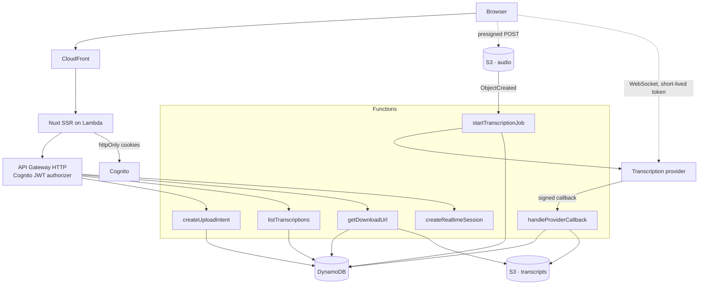

# Vocali Transcription Platform

A cloud service that lets registered users transcribe audio, either by uploading a file or by speaking into their microphone, and then browse and download their transcription history.

Targets AWS Lambda, DynamoDB, S3 and Cognito, defined end to end in Terraform, with a Nuxt front end.

## Status

Every capability the brief asks for is implemented and tested. Nothing has been deployed yet.

| Stage    | Contents                                                     | State                                   |
| -------- | ------------------------------------------------------------ | --------------------------------------- |
| Phase 1  | Shared contracts, domain model, every use case               | **Complete**                            |
| Phase 2A | AWS and provider adapters, Lambda handlers, composition root | **Complete**                            |
| Phase 2B | Terraform, CI/CD                                             | **Written and validated**, not deployed |
| Phase 3  | Nuxt front end                                               | **Complete**                            |

**What you can run today:**

```bash
pnpm install
pnpm typecheck
pnpm test
```

955 tests across the API, the front end and the shared contracts, none of which
touch the network or an AWS account. There is nothing to configure.

**What you cannot do yet:** use it. Signing in calls Cognito, and no
infrastructure exists, so the screens render but the first real action has
nothing behind it. `infra/` is validated offline — `terraform fmt`, `init
-backend=false` and `validate` pass in every module and environment — and the
function bundles have been built and imported to confirm each exports a handler
and refuses to boot without its configuration. None of that is the same as
applied.

The work was staged so that each layer was finished and tested before the next
depended on it. The ports are the hard part: once the domain and the use cases
are pinned by tests that run in about a second, the adapters behind those ports
are mechanical and the design cannot quietly drift while they are written.

## Contents

- [What it does](#what-it-does)
- [Architecture](#architecture)
- [Why the design looks like this](#why-the-design-looks-like-this)
- [Repository layout](#repository-layout)
- [Running it locally](#running-it-locally)
- [Testing](#testing)
- [Deployment](#deployment)
- [Decisions](#decisions)

## What it does

| Capability                          | Notes                                                       |
| ----------------------------------- | ----------------------------------------------------------- |
| Register and confirm an account     | Cognito user pool with mandatory email verification         |
| Sign in and out                     | Sign-out is invalidated at Cognito, not only in the browser |
| Transcribe an audio file            | Up to 20 MB, uploaded straight to S3                        |
| Transcribe live from the microphone | Partial results appear while you speak                      |
| Browse transcription history        | Ten per page, newest first, cursor paginated                |
| Download a transcription            | Short-lived signed URL, plain text or JSON                  |

The business rules behind every row — validation, state transitions, pagination, ownership — are implemented and tested, and so are the screens in front of them. What is missing is an AWS account to apply the infrastructure to.

## Architecture

Everything below is written and validated. None of it has been applied to an AWS account.



**Uploading a file.** The browser asks for an upload intent, receives a presigned POST, and sends the file straight to S3. An `ObjectCreated` event starts a transcription job, passing the provider a short-lived signed URL to fetch the audio itself. When the job finishes the provider calls back, the transcript is written to S3 and the record is marked complete.

**Live transcription.** A Lambda mints a token valid for sixty seconds and the browser opens a WebSocket directly to the provider. When the user stops, the final text is posted back and stored like any other transcription.

## Why the design looks like this

Three constraints shaped almost everything else.

**A 20 MB file cannot travel through the API.** API Gateway caps a request at 10 MB and Lambda at 6 MB, and base64 encoding inflates a payload by a third. The upload therefore goes directly from the browser to S3 via a presigned POST whose policy carries a `content-length-range` condition. The size limit is enforced by S3 itself, before any code runs — not by a validation that a client could lie its way past.

**Lambda cannot hold a duplex WebSocket.** Live transcription needs a persistent connection to the provider, and a function that lives for the length of one request cannot keep one. So the backend mints a short-lived credential and the browser connects directly. The long-lived API key never leaves the server, the audio never touches our infrastructure, and each session expires on its own.

**DynamoDB has no offset pagination.** History is a single `Query` on a partition key of `USER#<sub>` with a sort key of `TRANS#<ULID>`, read backwards with a limit of ten. The ULID makes chronological order free, the partition key makes cross-user isolation structural rather than a check someone can forget, and the client receives an opaque cursor. There is no `Scan` anywhere in the codebase.

## Repository layout

```
apps/api           Backend: domain, application, infrastructure, presentation
apps/web           Nuxt front end: components, pages, server routes
packages/contracts Zod schemas shared by both sides
infra              Terraform: bootstrap, modules, one directory per environment
docs/adr           Decision records
```

The backend follows a hexagonal structure. `domain` depends only on the shared contracts package, and only on its Zod-free constants entry point. `application` depends on `domain` and on port interfaces. `infrastructure` and `presentation` depend inwards and never the other way.

That rule is not a convention in a document — it is enforced by ESLint and breaks the build. Importing an AWS SDK from the domain layer fails `pnpm lint`, with a message naming the layer that was violated.

The front end follows Atomic Design, with one rule doing the same job: atoms, molecules and organisms are pure Vue and may not reach a Nuxt runtime composable. That is what lets them be mounted by Jest in milliseconds without booting Nuxt, and it is enforced the same way — a `useFetch` inside a component fails both the lint and the type check. Pages, layouts, middleware and server routes may use the runtime freely.

The practical benefit is that every use case is tested against in-memory doubles with no AWS, no network and no SDK mocks, so the whole business suite runs in about a second.

`packages/contracts` holds one Zod schema per endpoint, from which both the server's validation and the client's types are derived. A field cannot change on one side without breaking compilation on the other.

## Running it locally

Requires Node 24 and pnpm 10.

```bash
pnpm install
pnpm typecheck
pnpm test
pnpm test:coverage
```

No configuration is needed — nothing in the suite reaches the network or an AWS account.

The end-to-end suite needs a built front end and a server to drive, and no configuration either, because every call it makes to `/api/**` is answered in the browser:

```bash
pnpm --filter @vocali/web build
pnpm --filter @vocali/web preview &
pnpm e2e
```

Running the front end against real infrastructure needs the values in `.env.example`. Secrets themselves are read from AWS Parameter Store at runtime: nothing sensitive belongs in the repository or in a plaintext environment variable, so that file holds parameter paths and placeholders only.

## Testing

| Layer                | Tool                         | What it covers                                                     | State    |
| -------------------- | ---------------------------- | ------------------------------------------------------------------ | -------- |
| Domain and use cases | Jest                         | Entities, value objects, every use case, against in-memory doubles | Complete |
| Adapters             | Jest + `aws-sdk-client-mock` | DynamoDB, S3 and provider adapters, offline                        | Complete |
| Components           | Jest + Vue Test Utils        | Presentational components in isolation                             | Complete |
| End to end           | Cypress                      | The seven user journeys, in a browser against a built front end    | Complete |

The end-to-end suite answers every call to `/api/**` in the browser, and replaces the two capabilities that have no HTTP boundary — the microphone, through `getUserMedia`, and the provider's transcription stream, through the `WebSocket` constructor. It therefore proves what the browser does: the guarded routes and where a redirect lands, the multipart body the browser assembles for the presigned upload, the cursor the history pages by, and the signed URL asked for at click time. It proves nothing about AWS, which takes no part in it.

Coverage thresholds are enforced by `pnpm test:coverage` and fail the build. They have never been lowered to make a build pass.

One standard is applied throughout: **a test that still passes when the behaviour it targets is reverted is not testing anything.** Several tests here were rewritten after being checked that way — a null check that could not distinguish a correct record from an overwritten one, assertions that stayed green when the lifetime of a signed URL was cut from fifteen minutes to one second, and a cross-user isolation test whose assertion was true of both users' records.

## Deployment

Everything is defined in Terraform, under `infra/`: the remote state bootstrap, the Cognito user pool, the DynamoDB table, both buckets with their CORS and lifecycle rules, the eight functions with an execution role and a log group each, the HTTP API and its Cognito authorizer, the CloudFront distribution in front of the renderer, the alarms, and a deployment role assumed through OIDC so no long-lived AWS credential exists anywhere.

None of it has been applied. The gate it passes is offline: `terraform fmt`, `terraform init -backend=false` and `terraform validate` in every module and environment, plus a build of the eight function bundles to confirm each exports a handler and refuses to start without its configuration.

Nothing has been deployed. Every module and environment passes `terraform fmt -check`, `terraform init -backend=false` and `terraform validate` offline; `plan` is the first command that needs an AWS account. `infra/README.md` covers how it is composed and what it decides.

CI will run linting, formatting, type checking, unit tests with coverage, Cypress, and static analysis of the Terraform. Deployment authenticates to AWS through OIDC, so no long-lived AWS credentials are stored anywhere.

## Decisions

The decisions worth arguing about, each with the alternative that was rejected and the consequence accepted. The ones already recorded in full live in [`docs/adr/`](docs/adr).

- **Terraform rather than the Serverless Framework.** Most of this platform is not Lambda — Cognito, CloudFront, buckets, IAM, alarms — and one tool describing all of it in a single dependency graph is easier to review than a serverless manifest with a large block of raw CloudFormation attached.
- **Tokens in `httpOnly` cookies, set by the Nuxt server.** The browser never holds a Cognito token in JavaScript-readable storage, which removes the usual reward for a cross-site scripting bug.
- **The provider callback carries the transcription identity.** The webhook resolves its record by primary key rather than by a secondary index. This removed an index, the eventual-consistency race that index introduced, and the retry logic that race would have required — and it lets a completed transcription be recovered even if the job id was never persisted.
- **Duplicate deliveries are acknowledged, not rejected.** S3 events and provider callbacks are both at-least-once. A redelivery returns success without changing anything, so the sender stops retrying instead of filling a dead-letter queue with events that were never problems.
