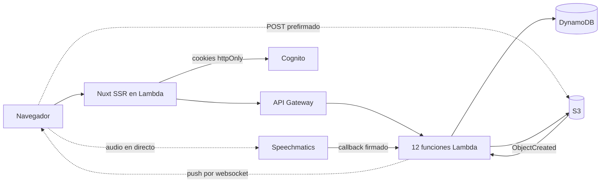

# Plataforma de transcripción Vocali

Servicio en la nube donde un usuario registrado transcribe audio, subiendo un fichero o hablando por el micrófono, y después consulta y descarga su historial.

## Qué hace

- Registro con verificación por email, y login
- Cierre de sesión invalidado en Cognito, no solo en el navegador
- Transcripción de ficheros de audio de hasta 20 MB
- Transcripción en directo desde el micrófono, con resultados parciales mientras hablas
- Historial paginado de diez en diez, del más reciente al más antiguo
- Descarga de cualquier transcripción en texto plano o JSON
- Tema claro y oscuro, e interfaz en español o inglés

## Con qué está hecho

| Capa            | Tecnología                        |
| --------------- | --------------------------------- |
| Backend         | Node 24, TypeScript, AWS Lambda   |
| Infraestructura | Terraform                         |
| Base de datos   | DynamoDB                          |
| Ficheros        | S3                                |
| Autenticación   | AWS Cognito                       |
| Frontend        | Nuxt 4, TypeScript, Tailwind      |
| Tests           | Jest y Cypress                    |
| Transcripción   | Speechmatics                      |
| CI/CD           | GitHub Actions, sin claves de AWS |

## Cómo levantarlo

Hace falta Node 24 y pnpm 10.

```bash
pnpm install
pnpm typecheck
pnpm test
```

Son 1.358 tests. Ninguno usa la red ni una cuenta de AWS, así que no hay nada que configurar antes.

Los tests end to end necesitan la aplicación construida y un servidor al que atacar:

```bash
pnpm --filter @vocali/web build
pnpm --filter @vocali/web preview &
pnpm e2e
```

Cuarenta tests repartidos en nueve recorridos, dentro de un navegador de verdad. Tampoco necesitan configuración: las llamadas a `/api/**` se responden en el propio navegador.

### Contra la infraestructura desplegada

Copia `.env.example` a `.env` y rellena los valores. Los secretos no van en ese fichero: se leen de AWS Parameter Store en tiempo de ejecución, así que ahí solo hay rutas de parámetros.

```bash
pnpm --filter @vocali/web build
pnpm --filter @vocali/web preview
```

En `http://localhost:3000` tienes la aplicación hablando con el Cognito, el DynamoDB y el S3 reales.

## Cómo está montado



Dos límites marcan casi todo lo demás.

Un fichero de 20 MB no cabe en una petición: API Gateway corta en 10 MB y Lambda en 6 MB. La subida va directa del navegador a S3 con un POST prefirmado, y el tamaño lo comprueba S3 antes de que corra código nuestro, así que no es una validación que un cliente pueda saltarse.

Una Lambda no puede mantener un socket abierto durante una consulta entera. Para el dictado en directo el backend emite una credencial que caduca en sesenta segundos y el navegador se conecta al proveedor por su cuenta. La clave de verdad no sale del servidor y el audio no pasa por nuestra infraestructura.

Cuando termina una transcripción de fichero, el aviso llega al navegador por un websocket de API Gateway. Ahí la conexión la mantiene el servicio, no la función: una se ejecuta al conectar, otra al desconectar, y enviar es una petición HTTPS normal.

## Estructura

```
apps/api            Backend: dominio, casos de uso, adaptadores y handlers
apps/web            Frontend Nuxt y su capa de servidor
packages/contracts  Esquemas Zod que comparten los dos lados
infra               Terraform: bootstrap, módulos y un directorio por entorno
docs/adr            Decisiones de arquitectura
```

El backend está en capas y el orden de dependencia lo comprueba ESLint: importar un SDK de AWS desde el dominio rompe `pnpm lint`. En el frontend pasa algo parecido, los componentes no pueden usar composables de Nuxt, y por eso Jest los monta en milisegundos sin arrancar el framework.

## Despliegue

El entorno `prod` está aplicado en AWS. Un workflow despliega el código cuando CI pasa en `main`, con aprobación manual y sin ninguna clave de AWS guardada en GitHub. Terraform lo aplica una persona: un rol capaz de hacer `terraform apply` puede reescribir cualquier política de la cuenta, y eso dejaría en papel mojado el resto de permisos.

Falta la puerta de entrada pública. AWS no permite CloudFront ni URLs de función públicas en cuentas sin verificar, así que el renderer todavía no tiene dirección propia. Todo lo que hay detrás está desplegado y respondiendo, y se ve levantando el frontend en local como se explica arriba.

Las decisiones que merecen discusión están en [`docs/adr`](docs/adr), en inglés.
